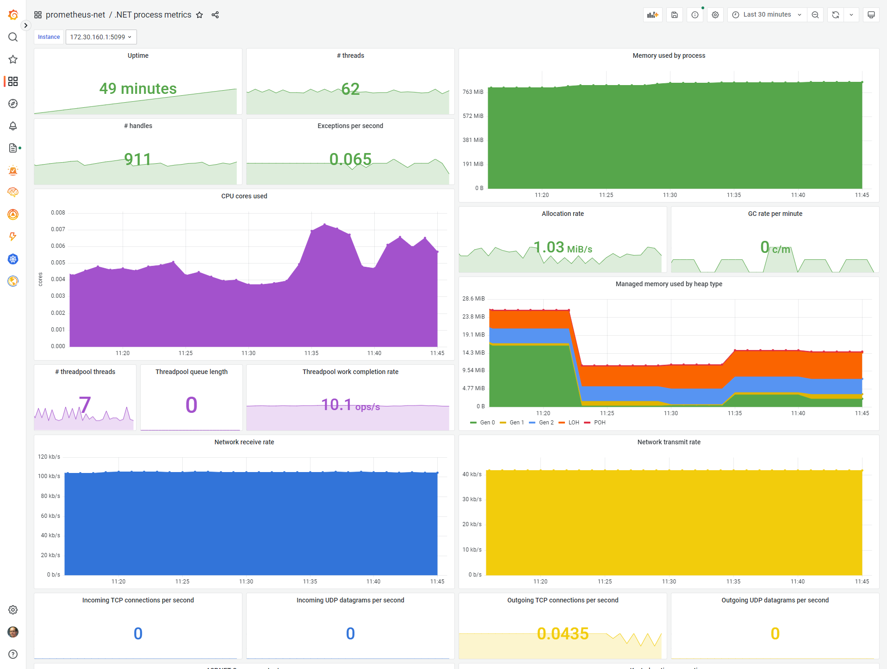

# prometheus-net

This is a .NET library for instrumenting your applications and exporting metrics to [Prometheus](http://prometheus.io/).

[](https://dev.azure.com/prometheus-net/prometheus-net/_build/latest?definitionId=1) [](https://www.nuget.org/packages/prometheus-net/) 



The library targets the following runtimes (and newer):

* .NET Framework 4.6.2
* .NET 6.0

# Table of contents

* [Best practices and usage](#best-practices-and-usage)
* [Quick start](#quick-start)
* [Installation](#installation)
* [Counters](#counters)
* [Gauges](#gauges)
* [Histogram](#histogram)
* [Summary](#summary)
* [Measuring operation duration](#measuring-operation-duration)
* [Tracking in-progress operations](#tracking-in-progress-operations)
* [Counting exceptions](#counting-exceptions)
* [Labels](#labels)
* [Static labels](#static-labels)
* [Exemplars](#exemplars)
* [Limiting exemplar volume](#limiting-exemplar-volume)
* [When are metrics published?](#when-are-metrics-published)
* [Deleting metrics](#deleting-metrics)
* [ASP.NET Core exporter middleware](#aspnet-core-exporter-middleware)
* [ASP.NET Core HTTP request metrics](#aspnet-core-http-request-metrics)
* [ASP.NET Core gRPC request metrics](#aspnet-core-grpc-request-metrics)
* [IHttpClientFactory metrics](#ihttpclientfactory-metrics)
* [ASP.NET Core health check status metrics](#aspnet-core-health-check-status-metrics)
* [Protecting the metrics endpoint from unauthorized access](#protecting-the-metrics-endpoint-from-unauthorized-access)
* [ASP.NET Web API exporter](#aspnet-web-api-exporter)
* [Kestrel stand-alone server](#kestrel-stand-alone-server)
* [Publishing to Pushgateway](#publishing-to-pushgateway)
* [Publishing to Pushgateway with basic authentication](#publishing-to-pushgateway-with-basic-authentication)
* [Publishing via standalone HTTP handler](#publishing-via-standalone-http-handler)
* [Publishing raw metrics document](#publishing-raw-metrics-document)
* [Just-in-time updates](#just-in-time-updates)
* [Suppressing default metrics](#suppressing-default-metrics)
* [DiagnosticSource integration](#diagnosticsource-integration)
* [EventCounter integration](#eventcounter-integration)
* [.NET Meters integration](#net-meters-integration)
* [Benchmarks](#benchmarks)
* [Community projects](#community-projects)

# Best practices and usage

This library allows you to instrument your code with custom metrics and provides some built-in metric collection integrations for ASP.NET Core.

The documentation here is only a minimal quick start. For detailed guidance on using Prometheus in your solutions, refer to the [prometheus-users discussion group](https://groups.google.com/forum/#!forum/prometheus-users). You are also expected to be familiar with the [Prometheus user guide](https://prometheus.io/docs/introduction/overview/). [/r/PrometheusMonitoring](https://www.reddit.com/r/PrometheusMonitoring/) on Reddit may also prove a helpful resource.

Four types of metrics are available: Counter, Gauge, Summary and Histogram. See the documentation on [metric types](http://prometheus.io/docs/concepts/metric_types/) and [instrumentation best practices](http://prometheus.io/docs/practices/instrumentation/#counter-vs.-gauge-vs.-summary) to learn what each is good for.

**The `Metrics` class is the main entry point to the API of this library.** The most common practice in C# code is to have a `static readonly` field for each metric that you wish to export from a given class.

More complex patterns may also be used (e.g. combining with dependency injection). The library is quite tolerant of different usage models - if the API allows it, it will generally work fine and provide satisfactory performance. The library is thread-safe.

# Quick start

After installing the library, you should:

1. Collect some metrics, either by using built-in integrations or publishing your own custom metrics.
1. Export the collected metrics over an HTTP endpoint (typically `/metrics`).
1. Configure a Prometheus server to poll this endpoint for metrics on a regular interval.

Minimal sample app (based on .NET 6 Console app template):

```csharp
using var server = new Prometheus.KestrelMetricServer(port: 1234);
server.Start();

Console.WriteLine("Open http://localhost:1234/metrics in a web browser.");
Console.WriteLine("Press enter to exit.");
Console.ReadLine();
```

Refer to the sample projects for quick start instructions:

| Name                                                                  | Description                                                                                                           |
|-----------------------------------------------------------------------|-----------------------------------------------------------------------------------------------------------------------|
| [Sample.Web](Sample.Web/Program.cs)                                   | ASP.NET Core application that produces custom metrics and uses multiple integrations to publish built-in metrics      |
| [Sample.Console](Sample.Console/Program.cs)                           | .NET console application that exports custom metrics                                                                  |
| [Sample.Console.DotNetMeters](Sample.Console.DotNetMeters/Program.cs) | Demonstrates how to [publish custom metrics via the .NET Meters API](#net-meters-integration)                         |
| [Sample.Console.Exemplars](Sample.Console.Exemplars/Program.cs)       | .NET console application that attaches exemplars to some metrics                                                      |
| [Sample.Console.NetFramework](Sample.Console.NetFramework/Program.cs) | Same as above but targeting .NET Framework                                                                            |
| [Sample.Console.NoAspNetCore](Sample.Console.NoAspNetCore/Program.cs) | .NET console application that exports custom metrics without requiring the ASP.NET Core runtime to be installed       |
| [Sample.Grpc](Sample.Grpc/Program.cs)                                 | ASP.NET Core application that publishes a gRPC service                                                                |
| [Sample.Grpc.Client](Sample.Grpc.Client/Program.cs)                   | Client app for the above                                                                                              |
| [Sample.NetStandard](Sample.NetStandard/ImportantProcess.cs)          | Demonstrates how to reference prometheus-net in a .NET Standard class library                                         |
| [Sample.Web.DifferentPort](Sample.Web.DifferentPort/Program.cs)       | Demonstrates how to set up the metric exporter on a different port from the main web API (e.g. for security purposes) |
| [Sample.Web.MetricExpiration](Sample.Web.MetricExpiration/Program.cs) | Demonstrates how to use [automatic metric deletion](#deleting-metrics)                                                |
| [Sample.Web.NetFramework](Sample.Web.NetFramework/Global.asax.cs)     | .NET Framework web app that publishes custom metrics                                                                  |

The rest of this document describes how to use individual features of the library.

# Installation

Nuget package for general use and metrics export via HttpListener or to Pushgateway: [prometheus-net](https://www.nuget.org/packages/prometheus-net)

>Install-Package prometheus-net

Nuget package for ASP.NET Core middleware and stand-alone Kestrel metrics server: [prometheus-net.AspNetCore](https://www.nuget.org/packages/prometheus-net.AspNetCore)

>Install-Package prometheus-net.AspNetCore

Nuget package for ASP.NET Core Health Check integration: [prometheus-net.AspNetCore.HealthChecks](https://www.nuget.org/packages/prometheus-net.AspNetCore.HealthChecks)

>Install-Package prometheus-net.AspNetCore.HealthChecks

Nuget package for ASP.NET Core gRPC integration: [prometheus-net.AspNetCore.Grpc](https://www.nuget.org/packages/prometheus-net.AspNetCore.Grpc)

>Install-Package prometheus-net.AspNetCore.Grpc

Nuget package for ASP.NET Web API middleware on .NET Framework: [prometheus-net.NetFramework.AspNet](https://www.nuget.org/packages/prometheus-net.NetFramework.AspNet)

>Install-Package prometheus-net.NetFramework.AspNet

# Counters

Counters only increase in value and reset to zero when the process restarts.

```csharp
private static readonly Counter ProcessedJobCount = Metrics
    .CreateCounter("myapp_jobs_processed_total", "Number of processed jobs.");

...

ProcessJob();
ProcessedJobCount.Inc();
```

# Gauges

Gauges can have any numeric value and change arbitrarily.

```csharp
private static readonly Gauge JobsInQueue = Metrics
    .CreateGauge("myapp_jobs_queued", "Number of jobs waiting for processing in the queue.");

...

jobQueue.Enqueue(job);
JobsInQueue.Inc();

...

var job = jobQueue.Dequeue();
JobsInQueue.Dec();
```

# Histogram

Histograms track the size and number of events in buckets. This allows for aggregatable calculation of quantiles.

```csharp
private static readonly Histogram OrderValueHistogram = Metrics
    .CreateHistogram("myapp_order_value_usd", "Histogram of received order values (in USD).",
        new HistogramConfiguration
        {
            // We divide measurements in 10 buckets of $100 each, up to $1000.
            Buckets = Histogram.LinearBuckets(start: 100, width: 100, count: 10)
        });

...

OrderValueHistogram.Observe(order.TotalValueUsd);
```

# Summary

Summaries track the trends in events over time (10 minutes by default).

```csharp
private static readonly Summary RequestSizeSummary = Metrics
    .CreateSummary("myapp_request_size_bytes", "Summary of request sizes (in bytes) over last 10 minutes.");

...

RequestSizeSummary.Observe(request.Length);
```

By default, only the sum and total count are reported. You may also specify quantiles to measure:

```csharp
private static readonly Summary RequestSizeSummary = Metrics
    .CreateSummary("myapp_request_size_bytes", "Summary of request sizes (in bytes) over last 10 minutes.",
        new SummaryConfiguration
        {
            Objectives = new[]
            {
                new QuantileEpsilonPair(0.5, 0.05),
                new QuantileEpsilonPair(0.9, 0.05),
                new QuantileEpsilonPair(0.95, 0.01),
                new QuantileEpsilonPair(0.99, 0.005),
            }
        });
```

The epsilon indicates the absolute error allowed in measurements. For more information, refer to the [Prometheus documentation on summaries and histograms](https://prometheus.io/docs/practices/histograms/).

# Measuring operation duration

Timers can be used to report the duration of an operation (in seconds) to a Summary, Histogram, Gauge or Counter. Wrap the operation you want to measure in a using block.

```csharp
private static readonly Histogram LoginDuration = Metrics
    .CreateHistogram("myapp_login_duration_seconds", "Histogram of login call processing durations.");

...

using (LoginDuration.NewTimer())
{
    IdentityManager.AuthenticateUser(Request.Credentials);
}
```

# Tracking in-progress operations

You can use `Gauge.TrackInProgress()` to track how many concurrent operations are taking place. Wrap the operation you want to track in a using block.

```csharp
private static readonly Gauge DocumentImportsInProgress = Metrics
    .CreateGauge("myapp_document_imports_in_progress", "Number of import operations ongoing.");

...

using (DocumentImportsInProgress.TrackInProgress())
{
    DocumentRepository.ImportDocument(path);
}
```

# Counting exceptions

You can use `Counter.CountExceptions()` to count the number of exceptions that occur while executing some code.


```csharp
private static readonly Counter FailedDocumentImports = Metrics
    .CreateCounter("myapp_document_imports_failed_total", "Number of import operations that failed.");

...

FailedDocumentImports.CountExceptions(() => DocumentRepository.ImportDocument(path));
```

You can also filter the exception types to observe:

```csharp
FailedDocumentImports.CountExceptions(() => DocumentRepository.ImportDocument(path), IsImportRelatedException);

bool IsImportRelatedException(Exception ex)
{
    // Do not count "access denied" exceptions - those are user error for pointing us to a forbidden file.
    if (ex is UnauthorizedAccessException)
        return false;

    return true;
}
```

# Labels

All metrics can have labels, allowing grouping of related time series.

See the best practices on [naming](http://prometheus.io/docs/practices/naming/)
and [labels](http://prometheus.io/docs/practices/instrumentation/#use-labels).

Taking a counter as an example:

```csharp
private static readonly Counter RequestCountByMethod = Metrics
    .CreateCounter("myapp_requests_total", "Number of requests received, by HTTP method.", labelNames: new[] { "method" });

...

// You can specify the values for the labels later, once you know the right values (e.g in your request handler code).
RequestCountByMethod.WithLabels("GET").Inc();
```

NB! Best practices of metric design is to **minimize the number of different label values**. For example:

* HTTP request method is a good choice for labeling - there are not many values.
* URL is a bad choice for labeling - it has many possible values and would lead to significant data processing inefficiency.

# Static labels

You can add static labels that always have fixed values. This is possible on two levels:

* on the metrics registry (e.g. `Metrics.DefaultRegistry`)
* on a metric factory (e.g. `Metrics.WithLabels()`)

All levels of labeling can be combined and instance-specific metric labels can also be applied on top, as usual.

Example with static labels on two levels and one instance-specific label:

```csharp
Metrics.DefaultRegistry.SetStaticLabels(new Dictionary<string, string>
{
  // Labels applied to all metrics in the registry.
  { "environment", "testing" }
});

var backgroundServicesMetricFactory = Metrics.WithLabels(new Dictionary<string, string>
{
  // Labels applied to all metrics created via this factory.
  { "category", "background-services" }
});

var requestsHandled = backgroundServicesMetricFactory
  .CreateCounter("myapp_requests_handled_total", "Count of requests handled, labelled by response code.", labelNames: new[] { "response_code" });

// Labels applied to individual instances of the metric.
requestsHandled.WithLabels("404").Inc();
requestsHandled.WithLabels("200").Inc();
```

# Exemplars

Exemplars facilitate [distributed tracing](https://learn.microsoft.com/en-us/dotnet/core/diagnostics/distributed-tracing-concepts), by attaching related trace IDs to metrics. This enables a metrics visualization app to cross-reference [traces](https://opentelemetry.io/docs/concepts/signals/traces/) that explain how the metric got the value it has.


See also, [Grafana fundamentals - introduction to exemplars](https://grafana.com/docs/grafana/latest/fundamentals/exemplars/).

By default, prometheus-net will create an exemplar with the `trace_id` and `span_id` labels based on the current distributed tracing context (`Activity.Current`). If using OpenTelemetry tracing with ASP.NET Core, the `traceparent` HTTP request header will be used to automatically assign `Activity.Current`.

```csharp
private static readonly Counter TotalSleepTime = Metrics
    .CreateCounter("sample_sleep_seconds_total", "Total amount of time spent sleeping.");
...

// You only need to create the Activity if one is not automatically assigned (e.g. by ASP.NET Core).
using (var activity = new Activity("Pausing before record processing").Start())
{
    var sleepStopwatch = Stopwatch.StartNew();
    await Task.Delay(TimeSpan.FromSeconds(1));

    // The trace_id and span_id from the current Activity are exposed as the exemplar.
    TotalSleepTime.Inc(sleepStopwatch.Elapsed.TotalSeconds);
}
```

This will be published as the following metric point:

```
sample_sleep_seconds_total 251.03833569999986 # {trace_id="08ad1c8cec52bf5284538abae7e6d26a",span_id="4761a4918922879b"} 1.0010688 1672634812.125
```

You can override any default exemplar logic by providing your own exemplar when updating the value of the metric:

```csharp
private static readonly Counter RecordsProcessed = Metrics
    .CreateCounter("sample_records_processed_total", "Total number of records processed.");

// The key from an exemplar key-value pair should be created once and reused to minimize memory allocations.
private static readonly Exemplar.LabelKey RecordIdKey = Exemplar.Key("record_id");
...

foreach (var record in recordsToProcess)
{
    var exemplar = Exemplar.From(RecordIdKey.WithValue(record.Id.ToString()));
    RecordsProcessed.Inc(exemplar);
}
```

> **Warning**
> Exemplars are limited to 128 ASCII characters (counting both keys and values) - they are meant to contain IDs for cross-referencing with trace databases, not as a replacement for trace databases.

Exemplars are only published if the metrics are being scraped by an OpenMetrics-capable client. For development purposes, you can force the library to use the OpenMetrics exposition format by adding `?accept=application/openmetrics-text` to the `/metrics` URL.

> **Note**
> The Prometheus database automatically negotiates OpenMetrics support when scraping metrics - you do not need to apply any special scraping configuration in production scenarios. You may need to [enable exemplar storage](https://prometheus.io/docs/prometheus/latest/feature_flags/#exemplars-storage), though.

See also, [Sample.Console.Exemplars](Sample.Console.Exemplars/Program.cs).

# Limiting exemplar volume

Exemplars can be expensive to store in the metrics database. For this reason, it can be useful to only record exemplars for "interesting" metric values.

You can use `ExemplarBehavior.NewExemplarMinInterval` to define a minimum interval between exemplars - a new exemplar will only be recorded if this much time has passed. This can be useful to limit the rate of publishing unique exemplars.

You can customize the default exemplar provider via `IMetricFactory.ExemplarBehavior` or `CounterConfiguration.ExemplarBehavior` and `HistogramConfiguration.ExemplarBehavior`, which allows you to provide your own method to generate exemplars and to filter which values/metrics exemplars are recorded for:

Example of a custom exemplar provider used together with exemplar rate limiting:

```csharp
// For the next histogram we only want to record exemplars for values larger than 0.1 (i.e. when record processing goes slowly).
static Exemplar RecordExemplarForSlowRecordProcessingDuration(Collector metric, double value)
{
    if (value < 0.1)
        return Exemplar.None;

    return Exemplar.FromTraceContext();
}

var recordProcessingDuration = Metrics
    .CreateHistogram("sample_record_processing_duration_seconds", "How long it took to process a record, in seconds.",
    new HistogramConfiguration
    {
        Buckets = Histogram.PowersOfTenDividedBuckets(-4, 1, 5),
        ExemplarBehavior = new()
        {
            DefaultExemplarProvider = RecordExemplarForSlowRecordProcessingDuration,
            // Even if we have interesting data more often, do not record it to conserve exemplar storage.
            NewExemplarMinInterval = TimeSpan.FromMinutes(5)
        }
    });
```

For the ASP.NET Core HTTP server metrics, you can further fine-tune exemplar recording by inspecting the HTTP request and response:

```csharp
app.UseHttpMetrics(options =>
{
    options.ConfigureMeasurements(measurementOptions =>
    {
        // Only measure exemplar if the HTTP response status code is not "OK".
        measurementOptions.ExemplarPredicate = context => context.Response.StatusCode != HttpStatusCode.Ok;
    });
});
```

# When are metrics published?

Metrics without labels are published immediately after the `Metrics.CreateX()` call. Metrics that use labels are published when you provide the label values for the first time.

Sometimes you want to delay publishing a metric until you have loaded some data and have a meaningful value to supply for it. The API allows you to suppress publishing of the initial value until you decide the time is right.

```csharp
private static readonly Gauge UsersLoggedIn = Metrics
    .CreateGauge("myapp_users_logged_in", "Number of active user sessions",
        new GaugeConfiguration
        {
            SuppressInitialValue = true
        });

...

// After setting the value for the first time, the metric becomes published.
UsersLoggedIn.Set(LoadSessions().Count);
```

You can also use `.Publish()` on a metric to mark it as ready to be published without modifying the initial value (e.g. to publish a zero). Conversely, you can use `.Unpublish()` to hide a metric temporarily. Note that the metric remains in memory and retains its value.

# Deleting metrics

You can use `.Dispose()` or `.RemoveLabelled()` methods on the metric classes to manually delete metrics at any time.

In some situations, it can be hard to determine when a metric with a specific set of labels becomes irrelevant and needs to be removed. The library provides some assistance here by enabling automatic expiration of metrics when they are no longer used.

To enable automatic expiration, create the metrics via the metric factory returned by `Metrics.WithManagedLifetime()`. All such metrics will have a fixed expiration time, with the expiration restarting based on certain conditions that indicate the metric is in use.

Option 1: metric lifetime can be controlled by leases - the metric expiration timer starts when the last lease is released (and will be reset when a new lease is taken again).

```csharp
var factory = Metrics.WithManagedLifetime(expiresAfter: TimeSpan.FromMinutes(5));

// With expiring metrics, we get back handles to the metric, not the metric directly.
var inProgressHandle = expiringMetricFactory
  .CreateGauge("documents_in_progress", "Number of documents currently being processed.",
    // Automatic metric deletion only makes sense if we have a high/unknown cardinality label set,
    // so here is a sample label for each "document provider", whoever that may be.
    labelNames: new[] { "document_provider" });

...

public void ProcessDocument(string documentProvider)
{
  // Automatic metric deletion will not occur while this lease is held.
  // This will also reset any existing expiration timer for this document provider.
  inProgressHandle.WithLease(metric =>
  {
    using (metric.TrackInProgress())
      DoDocumentProcessingWork();
  }, documentProvider);
  // Lease is released here.
  // If this was the last lease for this document provider, the expiration timer will now start.
}
```

Scenario 2: sometimes managing the leases is not required because you simply want the metric lifetime to be extended whenever the value is updated.

```csharp
var factory = Metrics.WithManagedLifetime(expiresAfter: TimeSpan.FromMinutes(5));

// With expiring metrics, we get back handles to the metric, not the metric directly.
var processingStartedHandle = expiringMetricFactory
  .CreateGauge("documents_started_processing_total", "Number of documents for which processing has started.",
    // Automatic metric deletion only makes sense if we have a high/unknown cardinality label set,
    // so here is a sample label for each "document provider", whoever that may be.
    labelNames: new[] { "document_provider" });

// This returns a metric instance that will reset the expiration timer whenever the metric value is updated.
var processingStarted = processingStartedHandle.WithExtendLifetimeOnUse();

...

public void ProcessDocument(string documentProvider)
{
  // This will reset the expiration timer for this document provider.
  processingStarted.WithLabels(documentProvider).Inc();

  DoDocumentProcessingWork();
}
```

The expiration logic is scoped to the factory. Multiple handles for the same metric from the same factory will share their expiration logic. However, handles for the same metric from different factories will have independent expiration logic.

See also, [Sample.Web.MetricExpiration](Sample.Web.MetricExpiration/Program.cs).

# ASP.NET Core exporter middleware

For projects built with ASP.NET Core, a middleware plugin is provided.

If you use the default Visual Studio project templates, modify the `UseEndpoints` call as follows:

* Add `endpoints.MapMetrics()` anywhere in the delegate body.

```csharp
public void Configure(IApplicationBuilder app, ...)
{
    // ...

    app.UseEndpoints(endpoints =>
    {
        // ...

        endpoints.MapMetrics();
    });
}
```

The default configuration will publish metrics on the `/metrics` URL.

The ASP.NET Core functionality is delivered in the `prometheus-net.AspNetCore` NuGet package.

See also, [Sample.Web](Sample.Web/Program.cs).

# ASP.NET Core HTTP request metrics

The library exposes some metrics from ASP.NET Core applications:

* Number of HTTP requests in progress.
* Total number of received HTTP requests.
* Duration of HTTP requests.

The ASP.NET Core functionality is delivered in the `prometheus-net.AspNetCore` NuGet package.

You can expose HTTP metrics by modifying your `Startup.Configure()` method:

* After `app.UseRouting()` add `app.UseHttpMetrics()`.

Example `Startup.cs`:

```csharp
public void Configure(IApplicationBuilder app, ...)
{
    // ...

    app.UseRouting();
    app.UseHttpMetrics();

    // ...
}
```

By default, metrics are collected separately for each response status code (200, 201, 202, 203, ...). You can considerably reduce the size of the data set by only preserving information about the first digit of the status code:

```csharp
app.UseHttpMetrics(options =>
{
    // This will preserve only the first digit of the status code.
    // For example: 200, 201, 203 -> 2xx
    options.ReduceStatusCodeCardinality();
});
```

NB! Exception handler middleware that changes HTTP response codes must be registered **after** `UseHttpMetrics()` in order to ensure that prometheus-net reports the correct HTTP response status code.

The `action`, `controller` and `endpoint` route parameters are always captured by default. If Razor Pages is in use, the `page` label will be captured to show the path to the page.

You can include additional route parameters as follows:

```csharp
app.UseHttpMetrics(options =>
{
    // Assume there exists a custom route parameter with this name.
    options.AddRouteParameter("api-version");
});
```

You can also extract arbitrary data from the HttpContext into label values as follows:

```csharp
app.UseHttpMetrics(options =>
{
    options.AddCustomLabel("host", context => context.Request.Host.Host);
});
```

See also, [Sample.Web](Sample.Web/Program.cs).

# ASP.NET Core gRPC request metrics

The library allows you to expose some metrics from ASP.NET Core gRPC services. These metrics include labels for service and method name.

You can expose gRPC metrics by modifying your `Startup.Configure()` method:
* After `app.UseRouting()` add `app.UseGrpcMetrics()`.

Example `Startup.cs`:

```csharp
public void Configure(IApplicationBuilder app, ...)
{
    // ...

    app.UseRouting();
    app.UseGrpcMetrics();

    // ...
}
```

The gRPC functionality is delivered in the `prometheus-net.AspNetCore.Grpc` NuGet package.

See also, [Sample.Grpc](Sample.Grpc/Program.cs).

# IHttpClientFactory metrics

This library allows you to expose metrics about HttpClient instances created using [IHttpClientFactory](https://docs.microsoft.com/en-us/aspnet/core/fundamentals/http-requests).

The exposed metrics include:

* Number of HTTP requests in progress.
* Total number of started HTTP requests.
* Duration of HTTP client requests (from start of request to end of reading response headers).
* Duration of HTTP client responses (from start of request to end of reading response body).

Example `Startup.cs` modification to enable these metrics for all HttpClients registered in the service collection:

```csharp
public void ConfigureServices(IServiceCollection services)
{
    // ...

    services.UseHttpClientMetrics();

    // ...
}
```

> **Note**
> You can also register HTTP client metrics only for a specific HttpClient by calling `services.AddHttpClient(...).UseHttpClientMetrics()`.

See also, [Sample.Web](Sample.Web/Program.cs).

# ASP.NET Core health check status metrics

You can expose the current status of [ASP.NET Core health checks](https://docs.microsoft.com/en-us/aspnet/core/host-and-deploy/health-checks) as Prometheus metrics by extending your `IHealthChecksBuilder` in the `Startup.ConfigureServices()` method:

```csharp
public void ConfigureServices(IServiceCollection services, ...)
{
    // ...

    services.AddHealthChecks()
        // ...
        <Your Health Checks>
        // ...
        .ForwardToPrometheus();

    // ...
}
```

The status of each health check will be published in the `aspnetcore_healthcheck_status` metric.

The ASP.NET Core health check integration is delivered in the `prometheus-net.AspNetCore.HealthChecks` NuGet package.

See also, [Sample.Web](Sample.Web/Program.cs).

# Protecting the metrics endpoint from unauthorized access

You may wish to restrict access to the metrics export URL. Documentation on how to apply ASP.NET Core security mechanisms is beyond the scope of this readme file but a good starting point may be to [require an authorization policy to be satisfied for accessing the endpoint](https://docs.microsoft.com/en-us/aspnet/core/security/authorization/policies?view=aspnetcore-6.0#apply-policies-to-endpoints)

```csharp
app.UseEndpoints(endpoints =>
{
    // ...

    // Assumes that you have previously configured the "ReadMetrics" policy (not shown).
    endpoints.MapMetrics().RequireAuthorization("ReadMetrics");
});
```

Another commonly used option is to expose a separate web server endpoint (e.g. a new `KestrelMetricServer` instance) on a different port, with firewall rules limiting access to only certain IP addresses. Refer to the sample project [Sample.Web.DifferentPort](Sample.Web.DifferentPort/Program.cs).

# ASP.NET Web API exporter

The easiest way to export metrics from an ASP.NET Web API app on the full .NET Framework is to use `AspNetMetricServer` in your `Global.asax.cs` file. Insert the following line to the top of the `Application_Start` method:

```csharp
protected void Application_Start(object sender, EventArgs e)
{
    AspNetMetricServer.RegisterRoutes(GlobalConfiguration.Configuration);

    // Other code follows.
}
```

The above snippet exposes metrics on the `/metrics` URL.

The `AspNetMetricServer` class is provided by the `prometheus-net.NetFramework.AspNet` NuGet package.

# Kestrel stand-alone server

In some situation, you may wish to start a stand-alone metric server using Kestrel (e.g. if your app has no other HTTP-accessible functionality).

```csharp
var metricServer = new KestrelMetricServer(port: 1234);
metricServer.Start();
```

The default configuration will publish metrics on the `/metrics` URL.

If your app is an ASP.NET Core web app, you can use a pipeline-integrated mechanism:

```csharp
services.AddMetricServer(options =>
{
    options.Port = 1234;
});
```

# Publishing to Pushgateway

Metrics can be posted to a [Pushgateway](https://prometheus.io/docs/practices/pushing/) server.

```csharp
var pusher = new MetricPusher(new MetricPusherOptions
{
    Endpoint = "https://pushgateway.example.org:9091/metrics",
    Job = "some_job"
});

pusher.Start();
```

Note that the default behavior of the metric pusher is to append metrics. You can use `MetricPusherOptions.ReplaceOnPush` to make it replace existing metrics in the same group, removing any that are no longer pushed.

# Publishing to Pushgateway with basic authentication

You can use a custom HttpClient to supply credentials for the Pushgateway.

```csharp
// Placeholder username and password here - replace with your own data.
var headerValue = Convert.ToBase64String(Encoding.UTF8.GetBytes("username:password"));
var httpClient = new HttpClient();
httpClient.DefaultRequestHeaders.Authorization = new AuthenticationHeaderValue("Basic", headerValue);

var pusher = new MetricPusher(new MetricPusherOptions
{
    Endpoint =  "https://pushgateway.example.org:9091/metrics",
    Job = "some_job",
    HttpClientProvider = () => httpClient
});

pusher.Start();
```

# Publishing via standalone HTTP handler

As a fallback option for scenarios where Kestrel or ASP.NET Core hosting is unsuitable, an `HttpListener` based metrics server implementation is also available.

```csharp
var metricServer = new MetricServer(port: 1234);
metricServer.Start();
```

The default configuration will publish metrics on the `/metrics` URL.

`MetricServer.Start()` may throw an access denied exception on Windows if your user does not have the right to open a web server on the specified port. You can use the *netsh* command to grant yourself the required permissions:

> netsh http add urlacl url=http://+:1234/metrics user=DOMAIN\user

# Publishing raw metrics document

In scenarios where you handle publishing via a custom endpoint, you can export the entire metrics data set as a Prometheus text document.

```csharp
await Metrics.DefaultRegistry.CollectAndExportAsTextAsync(outputStream);
```

# Just-in-time updates

In some scenarios you may want to only collect data when it is requested by Prometheus. To easily implement this scenario prometheus-net enables you to register a callback before every collection occurs. Register your callback using `Metrics.DefaultRegistry.AddBeforeCollectCallback()`.

Every callback will be executed before each collection, which will not finish until every callback has finished executing. Prometheus will expect each scrape to complete within a certain amount of seconds. To avoid timeouts, ensure that any registered callbacks execute quickly.

* A synchronous callback (of type `Action`) should not take more than a few milliseconds. Do not read data from remote systems in these callbacks.
* An asynchronous callback (of type `Func<CancellationToken, Task>`) is more suitable for long-running data collection work (lasting a few seconds). You can use asynchronous callbacks for reading data from remote systems.

```csharp
Metrics.DefaultRegistry.AddBeforeCollectCallback(async (cancel) =>
{
    // Probe a remote system.
    var response = await httpClient.GetAsync("https://google.com", cancel);

    // Increase a counter by however many bytes we loaded.
    googlePageBytes.Inc(response.Content.Headers.ContentLength ?? 0);
});
```

# Suppressing default metrics

The library enables various default metrics and integrations by default. If these default metrics are not desirable you may remove them by calling `Metrics.SuppressDefaultMetrics()` before registering any of your own metrics.

# DiagnosticSource integration

[.NET Core provides the DiagnosticSource mechanism for reporting diagnostic events](https://github.com/dotnet/runtime/blob/master/src/libraries/System.Diagnostics.DiagnosticSource/src/DiagnosticSourceUsersGuide.md), used widely by .NET and ASP.NET Core classes. To expose basic data on these events via Prometheus, you can use the `DiagnosticSourceAdapter` class:

```csharp
// An optional "options" parameter is available to customize adapter behavior.
var registration = DiagnosticSourceAdapter.StartListening();

...

// Stops listening for DiagnosticSource events.
registration.Dispose();
```

Any events that occur are exported as Prometheus metrics, indicating the name of the event source and the name of the event:

```
diagnostic_events_total{source="Microsoft.AspNetCore",event="Microsoft.AspNetCore.Mvc.AfterAction"} 4
diagnostic_events_total{source="HttpHandlerDiagnosticListener",event="System.Net.Http.Request"} 8
```

The level of detail obtained from this is rather low - only the total count for each event is exported. For more fine-grained analytics, you need to listen to DiagnosticSource events on your own and create custom metrics that can understand the meaning of each particular type of event that is of interest to you.

# EventCounter integration

> **Note**
> The output produced by this integration has changed significantly between prometheus-net 6.0 and prometheus-net 7.0. The old output format is no longer supported.

[.NET Core provides the EventCounter mechanism for reporting diagnostic events](https://docs.microsoft.com/en-us/dotnet/core/diagnostics/event-counters), used used widely by .NET and ASP.NET Core classes. This library publishes all .NET EventCounter data by default. To suppress this, see [Suppressing default metrics](#suppressing-default-metrics).

You can configure the integration using `Metrics.ConfigureEventCounterAdapter()`.

By default, prometheus-net will only publish [the well-known .NET EventCounters](https://learn.microsoft.com/en-us/dotnet/core/diagnostics/available-counters) to minimize resource consumption in the default configuration. A custom event source filter must be provided in the configuration to enable publishing of additional event counters.

See also, [Sample.Console](Sample.Console/Program.cs).

# .NET Meters integration

> **Note**
> The output produced by this integration has changed significantly between prometheus-net 6.0 and prometheus-net 7.0. The old output format is no longer supported.

[.NET provides the Meters mechanism for reporting diagnostic metrics](https://docs.microsoft.com/en-us/dotnet/core/diagnostics/metrics). This library publishes all .NET Meters API data by default. To suppress this, see [Suppressing default metrics](#suppressing-default-metrics).

You can configure the integration using `Metrics.ConfigureMeterAdapter()`.

See also, [Sample.Console.DotNetMeters](Sample.Console.DotNetMeters/Program.cs).

# Benchmarks

A suite of benchmarks is included if you wish to explore the performance characteristics of the library. Simply build and run the `Benchmarks.NetCore` project in Release mode.

As an example of the performance of measuring data using prometheus-net, we have the results of the MeasurementBenchmarks here, converted into measurements per second:

| Metric type             | Measurements per second |
|-------------------------|------------------------:|
| Counter                 |             261 million |
| Gauge                   |             591 million |
| Histogram (16 buckets)  |             105 million |
| Histogram (128 buckets) |              65 million |

Another popular .NET SDK with Prometheus support is the OpenTelemetry SDK. To help you choose, we have [SdkComparisonBenchmarks.cs](Benchmark.NetCore/SdkComparisonBenchmarks.cs) to compare the two SDKs and give some idea of how they differer in the performance tradeoffs made. Both SDKs are evaluated in single-threaded mode under a comparable workload and enabled feature set. A representative result is here:

| SDK            | Benchmark scenario                    | CPU time | Memory |
|----------------|---------------------------------------|---------:|-------:|
| prometheus-net | Counter (existing timeseries) x100K   |   230 µs |   None |
| OpenTelemetry  | Counter (existing timeseries) x100K   | 10998 µs |   None |
| prometheus-net | Histogram (existing timeseries) x100K |   957 µs |   None |
| OpenTelemetry  | Histogram (existing timeseries) x100K | 12110 µs |   None |
| prometheus-net | Histogram (new timeseries) x1K        |   716 µs | 664 KB |
| OpenTelemetry  | Histogram (new timeseries) x1K        |   350 µs |  96 KB |

# Community projects

Some useful related projects are:

* [prometheus-net.DotNetRuntime](https://github.com/djluck/prometheus-net.DotNetRuntime) instruments .NET Core apps to export metrics on .NET Core performance.
* [prometheus-net.AspNet](https://github.com/rocklan/prometheus-net.AspNet) instruments ASP.NET full framework apps to export metrics on performance.
* [prometheus-net.SystemMetrics](https://github.com/Daniel15/prometheus-net.SystemMetrics) exports various system metrics such as CPU usage, disk usage, etc.
* [prometheus-net Grafana dashboards](https://github.com/prometheus-net/grafana-dashboards) provides example dashboards for visualizing prometheus-net metrics in [Grafana](https://grafana.com/).
* [PromQL.Parser](https://github.com/djluck/PromQL.Parser) enables you to parse and create Prometheus queries in C#.

Note: to avoid confusion between "official" prometheus-net and community maintained packages, the `prometheus-net` namespace is protected on nuget.org. However, the `prometheus-net.Contrib.*` namespace allows package publishing by all authors.
